<div align="center">

# ☁️ Cloud-Native DevOps Delivery Pipeline
## Jenkins Multibranch CI • Docker • AWS EKS • Argo CD GitOps • Prometheus • Grafana

<p>
  
  
  
  
  
  
  
  
</p>

### A practical end-to-end project that shows how application code moves from a developer branch to a live Kubernetes workload using CI, containerization, GitOps, cloud infrastructure, and monitoring.

**Build → Test/Package → Push → Update Git → Sync → Deploy → Observe**

</div>

---

# 📚 Table of Contents

1. [Project Overview](#-project-overview)
2. [What This Project Demonstrates](#-what-this-project-demonstrates)
3. [High-Level Architecture](#-high-level-architecture)
4. [How the Complete Flow Works](#-how-the-complete-flow-works)
5. [CI/CD Sequence Diagram](#-cicd-sequence-diagram)
6. [GitOps Deployment Model](#-gitops-deployment-model)
7. [Kubernetes Runtime Architecture](#-kubernetes-runtime-architecture)
8. [Monitoring Architecture](#-monitoring-architecture)
9. [Application Features](#-application-features)
10. [Repository Structure](#-repository-structure)
11. [Tools and Responsibilities](#-tools-and-responsibilities)
12. [Prerequisites](#-prerequisites)
13. [Step 1 — Clone and Prepare the Repository](#-step-1--clone-and-prepare-the-repository)
14. [Step 2 — Run the Flask Application Locally](#-step-2--run-the-flask-application-locally)
15. [Step 3 — Build and Run with Docker](#-step-3--build-and-run-with-docker)
16. [Step 4 — Prepare the Jenkins Server](#-step-4--prepare-the-jenkins-server)
17. [Step 5 — Install Docker on the Jenkins Server](#-step-5--install-docker-on-the-jenkins-server)
18. [Step 6 — Install AWS CLI, kubectl, eksctl and Helm](#-step-6--install-aws-cli-kubectl-eksctl-and-helm)
19. [Step 7 — Create the AWS EKS Cluster](#-step-7--create-the-aws-eks-cluster)
20. [Step 8 — Deploy Kubernetes Manifests Manually](#-step-8--deploy-kubernetes-manifests-manually)
21. [Step 9 — Configure Jenkins Multibranch Pipeline](#-step-9--configure-jenkins-multibranch-pipeline)
22. [Step 10 — Understand the Jenkins Pipeline](#-step-10--understand-the-jenkins-pipeline)
23. [Step 11 — Install and Configure Argo CD](#-step-11--install-and-configure-argo-cd)
24. [Step 12 — Connect Argo CD to the Git Repository](#-step-12--connect-argo-cd-to-the-git-repository)
25. [Step 13 — Install Prometheus and Grafana](#-step-13--install-prometheus-and-grafana)
26. [Branching Workflow](#-branching-workflow)
27. [Important Configuration Corrections](#-important-configuration-corrections)
28. [Recommended Repository Strategy](#-recommended-repository-strategy)
29. [Validation Checklist](#-validation-checklist)
30. [Troubleshooting](#-troubleshooting)
31. [Security and Production Improvements](#-security-and-production-improvements)
32. [Cleanup](#-cleanup)
33. [Skills Demonstrated](#-skills-demonstrated)
34. [Future Enhancements](#-future-enhancements)
35. [Author](#-author)

---

# 🌟 Project Overview

This repository demonstrates a **production-style cloud-native software delivery workflow** using a Python Flask e-commerce application as the workload.

The main goal is not only to run a Flask application. The project shows how different DevOps technologies work together as one delivery system:

```text
Developer
   ↓
Git / GitHub
   ↓
Jenkins Multibranch CI
   ↓
Docker Build
   ↓
Container Registry
   ↓
Kubernetes Manifest Update
   ↓
Git Repository
   ↓
Argo CD GitOps
   ↓
AWS EKS
   ↓
Prometheus + Grafana
```

The application used in the project is **ShopEasy**, a lightweight Flask e-commerce application with product browsing, search, cart operations, checkout simulation, and feature-branch examples.

> **Important:** This is a strong portfolio/lab architecture for learning and demonstrating DevOps concepts. It is described as **production-style** rather than claiming that the repository is already fully production-hardened. A real production environment would normally add stronger security, testing, secrets management, ingress/TLS, autoscaling, centralized logging, policy controls, backup strategy, and infrastructure-as-code.

---

# 🎯 What This Project Demonstrates

The project brings together the complete delivery lifecycle:

| Area | What is demonstrated |
|---|---|
| Source Control | Git branching, feature development, pull requests and main-branch integration |
| Continuous Integration | Jenkins Multibranch Pipeline automatically discovers and builds branches |
| Containerization | Flask application packaged as a Docker image |
| Image Versioning | Jenkins build number used as the container image tag |
| Registry | Versioned application images pushed to a container registry |
| Kubernetes | Application deployed using Deployment and Service manifests |
| Cloud | Kubernetes cluster hosted on AWS EKS |
| GitOps | Argo CD watches Git and synchronizes the desired state to EKS |
| Self-Healing | Argo CD can restore cluster state when it drifts from Git |
| Monitoring | Prometheus collects Kubernetes metrics |
| Visualization | Grafana provides dashboards for cluster, nodes, pods and deployments |
| Delivery Traceability | Git commit → Jenkins build → image tag → manifest → Kubernetes deployment |

---

# 🏗️ High-Level Architecture

The following diagram shows the major components and their responsibilities.

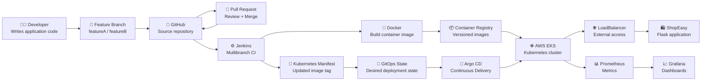

### What happens in this architecture?

1. A developer creates or updates a feature branch.
2. The branch is pushed to GitHub.
3. Jenkins Multibranch Pipeline discovers the branch.
4. Feature branches can be validated without automatically changing production.
5. After review, the feature is merged into `main`.
6. Jenkins builds a Docker image for the main branch.
7. The image is tagged with a unique Jenkins build number.
8. Jenkins pushes the image to the container registry.
9. Jenkins updates the Kubernetes manifest with the new image tag.
10. The manifest change is committed to the Git repository used by Argo CD.
11. Argo CD detects the Git change.
12. Argo CD synchronizes the desired state to AWS EKS.
13. Kubernetes performs a rolling deployment.
14. The Service exposes the Flask application.
15. Prometheus collects infrastructure/workload metrics.
16. Grafana visualizes those metrics.

---

# 🔁 How the Complete Flow Works

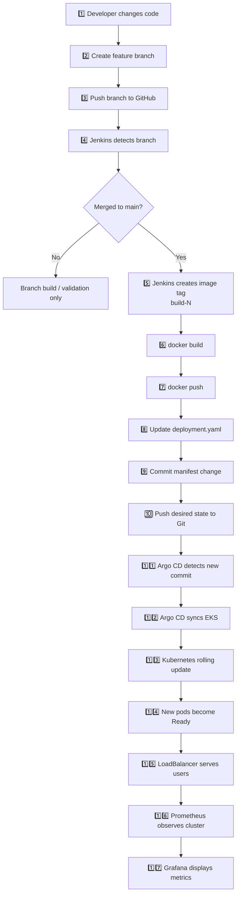

### Why this design is useful

The CI and CD responsibilities are separated:

- **Jenkins = CI / build automation**
- **Argo CD = GitOps / Kubernetes delivery**
- **Git = source of truth for desired deployment state**

Jenkins does not need to continuously run `kubectl apply` against production. Instead, it changes the desired state in Git. Argo CD is responsible for making the cluster match that state.

This gives better traceability because the deployed configuration is visible in version control.

---

# 🔃 CI/CD Sequence Diagram

This sequence diagram shows the order of communication between the systems.

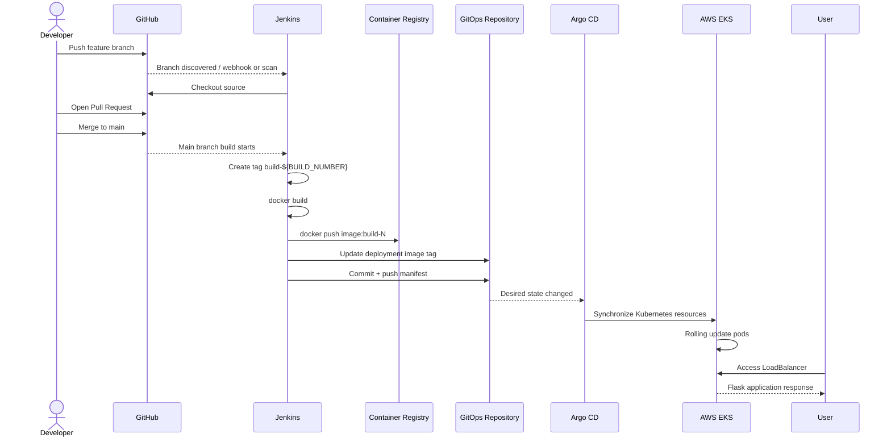

---

# 🔄 GitOps Deployment Model

Traditional deployment often looks like this:

```text
CI Server → kubectl apply → Kubernetes
```

This project moves toward a GitOps model:

```text
CI Server → Update Git → Argo CD → Kubernetes
```

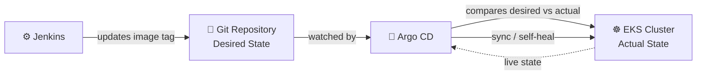

### Desired state

The Kubernetes YAML in Git says what the application **should look like**:

- number of replicas
- container image
- labels
- ports
- service type

### Actual state

AWS EKS contains what is **currently running**.

### Argo CD's job

Argo CD continuously compares:

```text
Desired State in Git
        VS
Actual State in Kubernetes
```

If they are different, Argo CD can synchronize them.

The project currently enables:

```yaml
syncPolicy:
  automated:
    prune: true
    selfHeal: true
```

Meaning:

- `automated` → changes can deploy without manually pressing Sync
- `prune: true` → resources removed from Git can be removed from the cluster
- `selfHeal: true` → manual drift in the cluster can be corrected back to Git state

---

# ☸️ Kubernetes Runtime Architecture

The current Kubernetes deployment defines **5 replicas** of the Flask workload.

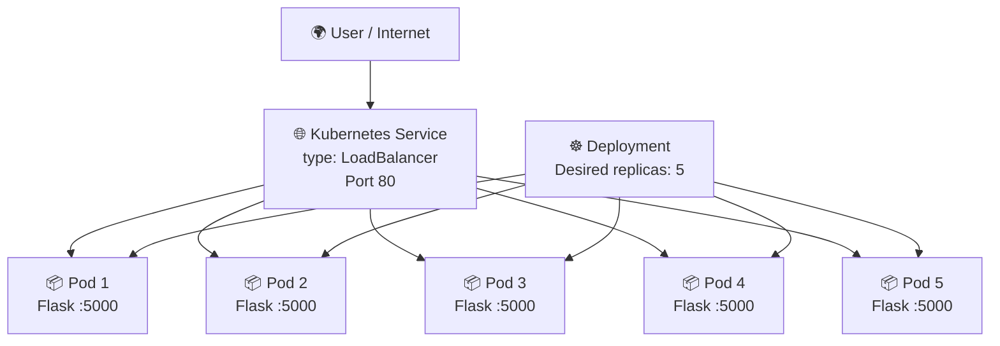

### Port mapping

The Flask application listens on:

```text
Container Port: 5000
```

The Kubernetes Service exposes:

```text
Service Port: 80
Target Port: 5000
```

So the network path is:

```text
Browser
   ↓
AWS LoadBalancer :80
   ↓
Kubernetes Service :80
   ↓
Pod :5000
   ↓
Flask Application
```

---

# 📊 Monitoring Architecture

Prometheus and Grafana are deployed using `kube-prometheus-stack`.

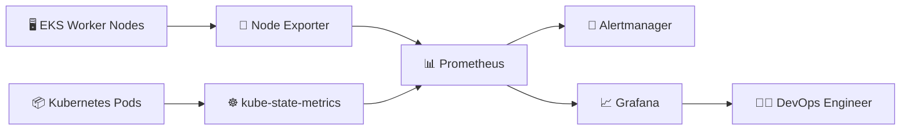

### What each monitoring component does

| Component | Responsibility |
|---|---|
| Prometheus | Stores and queries time-series metrics |
| Grafana | Converts metrics into dashboards and graphs |
| Node Exporter | Exposes worker-node operating-system metrics |
| kube-state-metrics | Exposes Kubernetes object/state metrics |
| Alertmanager | Handles alert routing generated from Prometheus rules |

Typical dashboards:

- Kubernetes / Cluster
- Kubernetes / Nodes
- Kubernetes / Pods
- Kubernetes / Deployments
- Node Exporter

---

# 🛍️ Application Features

The base Flask application contains:

- Product catalog
- Search
- Category filtering
- Add to cart
- Remove from cart
- Update quantity
- Cart total calculation
- Checkout simulation
- Session-based cart state
- Responsive Tailwind-based UI

The feature examples extend the application further.

### Feature A example

The uploaded `FeatureA Branch Code` includes functionality such as:

- wishlist
- clear wishlist
- product reviews
- cart operations

### Feature B example

The uploaded `FeatureB Branch Code` includes functionality such as:

- registration
- login
- logout
- current-user handling
- order retrieval
- checkout flow
- wishlist
- reviews
- cart functionality

These feature variations are useful for demonstrating why a **Multibranch Pipeline** matters: each branch can contain different application functionality while sharing a common CI workflow.

---

# 📁 Repository Structure

The uploaded training archive is currently organized like this:

```text
Production-Grade-Deployment-main/
│
├── README.md
├── Document.txt
│
├── Main Branch Code/
│   ├── app.py
│   ├── requirements.txt
│   ├── Dockerfile
│   ├── Jenkinsfile
│   │
│   ├── k8s/
│   │   ├── deployment.yaml
│   │   └── service.yaml
│   │
│   └── argocd/
│       └── application.yaml
│
├── FeatureA Branch Code/
│   └── featureA-Code.py
│
└── FeatureB Branch Code/
    └── featureB-Code.py
```

For a real GitHub repository, a cleaner main-branch structure is:

```text
shopeasy-devops/
│
├── app.py
├── requirements.txt
├── Dockerfile
├── Jenkinsfile
├── README.md
│
├── k8s/
│   ├── deployment.yaml
│   └── service.yaml
│
└── argocd/
    └── application.yaml
```

Then create actual Git branches:

```text
main
├── featureA
└── featureB
```

Instead of storing branch code permanently in folders named `FeatureA Branch Code` and `FeatureB Branch Code`.

---

# 🧰 Tools and Responsibilities

| Tool | Responsibility in this project | Why it is used |
|---|---|---|
| Git | Tracks source changes | Gives version history and branching |
| GitHub | Hosts Git repository | PR workflow and centralized collaboration |
| Jenkins | Executes CI pipeline | Automates image build/push and manifest update |
| Docker | Builds application image | Produces portable immutable application package |
| Docker Hub / Registry | Stores images | Kubernetes can pull versioned application builds |
| AWS | Cloud platform | Hosts the infrastructure |
| Amazon EKS | Managed Kubernetes | Runs containerized workloads |
| kubectl | Kubernetes CLI | Inspect and administer cluster resources |
| eksctl | EKS CLI helper | Simplifies EKS cluster creation/deletion |
| Helm | Kubernetes package manager | Installs Argo CD and monitoring stack |
| Argo CD | GitOps CD controller | Reconciles Git state with Kubernetes |
| Prometheus | Metrics platform | Collects Kubernetes/node/application metrics |
| Grafana | Visualization platform | Displays operational dashboards |
| Flask | Python web framework | Demo workload being delivered |

---

# ✅ Prerequisites

Before starting, you should have:

- An AWS account
- An IAM identity with permissions required to create EKS resources
- A GitHub account
- A container registry account such as Docker Hub
- An Ubuntu-based Jenkins host or equivalent build agent
- Git installed
- Basic Linux command-line knowledge

Recommended architecture:

```text
Developer Machine
      │
      ├── Git
      └── GitHub
             │
             ▼
      Jenkins EC2 Instance
             │
             ├── Jenkins
             └── Docker

      AWS EKS Cluster
             │
             ├── Argo CD
             ├── ShopEasy
             ├── Prometheus
             └── Grafana
```

---

# 1️⃣ Step 1 — Clone and Prepare the Repository

Replace the placeholder with your actual repository.

```bash
git clone https://github.com/<YOUR_GITHUB_USERNAME>/<YOUR_REPOSITORY>.git
cd <YOUR_REPOSITORY>
```

### What these commands do

`git clone`

Downloads the complete Git repository to your local machine.

`cd`

Changes the terminal working directory into the project.

Check the repository:

```bash
git status
git branch -a
```

### Expected result

You should see the current branch and any remote branches available in the repository.

---

# 2️⃣ Step 2 — Run the Flask Application Locally

Go to the directory containing `app.py` and `requirements.txt`.

Create a Python virtual environment:

```bash
python3 -m venv venv
```

### Why?

A virtual environment keeps this project's Python packages isolated from system Python and other projects.

Activate it:

```bash
source venv/bin/activate
```

On Windows PowerShell:

```powershell
venv\Scripts\Activate.ps1
```

Install dependencies:

```bash
pip install -r requirements.txt
```

The current project dependency is:

```text
flask==3.0.3
```

Run the application:

```bash
python app.py
```

Open:

```text
http://localhost:5000
```

### Verification

From another terminal:

```bash
curl http://localhost:5000
```

If HTML is returned, the Flask application is running.

---

# 3️⃣ Step 3 — Build and Run with Docker

The project Dockerfile is conceptually:

```dockerfile
FROM python:3.11-slim

WORKDIR /app

COPY requirements.txt .

RUN pip install --no-cache-dir -r requirements.txt

COPY app.py .

EXPOSE 5000

CMD ["python", "app.py"]
```

## Dockerfile explanation

| Instruction | Meaning |
|---|---|
| `FROM python:3.11-slim` | Uses a compact Python 3.11 base image |
| `WORKDIR /app` | Sets `/app` as the working directory |
| `COPY requirements.txt .` | Copies dependency definition first |
| `RUN pip install ...` | Installs Flask dependency |
| `COPY app.py .` | Copies the application into the image |
| `EXPOSE 5000` | Documents the application port |
| `CMD ["python", "app.py"]` | Starts Flask when the container starts |

Build the image:

```bash
docker build -t shopeasy-app:local .
```

### What happens?

Docker:

1. reads the Dockerfile
2. downloads the Python base image if required
3. installs Python dependencies
4. copies the application
5. creates a reusable image named `shopeasy-app`
6. applies the `local` tag

Check the image:

```bash
docker images
```

Run it:

```bash
docker run -d \
  --name shopeasy \
  -p 5000:5000 \
  shopeasy-app:local
```

### Command explanation

- `-d` → detached/background mode
- `--name shopeasy` → human-readable container name
- `-p 5000:5000` → maps host port 5000 to container port 5000
- `shopeasy-app:local` → image and tag to run

Check:

```bash
docker ps
```

View logs:

```bash
docker logs shopeasy
```

Test:

```bash
curl http://localhost:5000
```

Stop and remove:

```bash
docker stop shopeasy
docker rm shopeasy
```

---

# 4️⃣ Step 4 — Prepare the Jenkins Server

A common lab setup is an Ubuntu 24.04 EC2 instance.

> The exact EC2 type depends on expected build load. Avoid describing a lab instance size as universally correct for production.

Update packages:

```bash
sudo apt update
sudo apt upgrade -y
```

Install Java:

```bash
sudo apt install -y fontconfig openjdk-21-jre
```

Verify:

```bash
java -version
```

## Install Jenkins

Add the current Jenkins signing key and repository:

```bash
sudo mkdir -p /etc/apt/keyrings

sudo wget -O /etc/apt/keyrings/jenkins-keyring.asc \
  https://pkg.jenkins.io/debian/jenkins.io-2026.key

echo "deb [signed-by=/etc/apt/keyrings/jenkins-keyring.asc] https://pkg.jenkins.io/debian binary/" \
  | sudo tee /etc/apt/sources.list.d/jenkins.list > /dev/null
```

Install:

```bash
sudo apt update
sudo apt install -y jenkins
```

Enable and start:

```bash
sudo systemctl enable jenkins
sudo systemctl start jenkins
```

Check:

```bash
sudo systemctl status jenkins
```

Jenkins normally listens on:

```text
http://<JENKINS-SERVER-IP>:8080
```

Get the initial administrator password:

```bash
sudo cat /var/lib/jenkins/secrets/initialAdminPassword
```

### AWS Security Group requirement

For a lab, allow TCP `8080` only from a trusted source IP whenever possible.

Avoid opening administrative interfaces to the entire internet in a real environment.

---

# 5️⃣ Step 5 — Install Docker on the Jenkins Server

The original project notes only configured the Docker repository but did not complete the package installation. Use the complete flow below.

Remove conflicting packages if present:

```bash
sudo apt remove -y docker.io docker-compose docker-compose-v2 docker-doc docker-buildx podman-docker containerd runc || true
```

Install prerequisites:

```bash
sudo apt update
sudo apt install -y ca-certificates curl
```

Add Docker's official GPG key:

```bash
sudo install -m 0755 -d /etc/apt/keyrings

sudo curl -fsSL https://download.docker.com/linux/ubuntu/gpg \
  -o /etc/apt/keyrings/docker.asc

sudo chmod a+r /etc/apt/keyrings/docker.asc
```

Add the Docker repository:

```bash
sudo tee /etc/apt/sources.list.d/docker.sources > /dev/null <<EOF
Types: deb
URIs: https://download.docker.com/linux/ubuntu
Suites: $(. /etc/os-release && echo "${UBUNTU_CODENAME:-$VERSION_CODENAME}")
Components: stable
Architectures: $(dpkg --print-architecture)
Signed-By: /etc/apt/keyrings/docker.asc
EOF
```

Install Docker Engine:

```bash
sudo apt update

sudo apt install -y \
  docker-ce \
  docker-ce-cli \
  containerd.io \
  docker-buildx-plugin \
  docker-compose-plugin
```

Verify:

```bash
sudo docker run hello-world
docker --version
```

Allow Jenkins to use Docker:

```bash
sudo usermod -aG docker jenkins
sudo systemctl restart jenkins
```

### Why is this required?

The Jenkins pipeline runs:

```bash
docker build
docker login
docker push
```

The Jenkins service runs under the `jenkins` Linux user. That user therefore needs permission to access the Docker daemon.

### Security note

Membership in the Docker group is effectively highly privileged. For stronger production isolation, use dedicated build agents, rootless/containerized builders, or a purpose-built CI execution environment.

---

# 6️⃣ Step 6 — Install AWS CLI, kubectl, eksctl and Helm

These tools are used to create and administer the EKS/GitOps environment.

---

## Install AWS CLI v2

```bash
sudo apt update
sudo apt install -y unzip curl
```

Download:

```bash
curl "https://awscli.amazonaws.com/awscli-exe-linux-x86_64.zip" \
  -o "awscliv2.zip"
```

Extract:

```bash
unzip awscliv2.zip
```

Install:

```bash
sudo ./aws/install
```

Verify:

```bash
aws --version
```

Configure credentials for a learning environment:

```bash
aws configure
```

Verify identity:

```bash
aws sts get-caller-identity
```

### Why this verification matters

Before creating EKS resources, confirm which AWS account and IAM identity your CLI is using.

In production, prefer instance roles / IAM roles rather than storing long-lived access keys on servers.

---

## Install kubectl

Download the current stable Linux binary:

```bash
curl -LO "https://dl.k8s.io/release/$(curl -L -s https://dl.k8s.io/release/stable.txt)/bin/linux/amd64/kubectl"
```

Install:

```bash
chmod +x kubectl
sudo mv kubectl /usr/local/bin/kubectl
```

Verify:

```bash
kubectl version --client
```

### What is kubectl?

`kubectl` is the command-line client used to communicate with the Kubernetes API server.

Examples:

```bash
kubectl get nodes
kubectl get pods
kubectl describe pod <pod-name>
kubectl logs <pod-name>
```

---

## Install eksctl

```bash
curl --silent --location \
  "https://github.com/eksctl-io/eksctl/releases/latest/download/eksctl_$(uname -s)_amd64.tar.gz" \
  | tar xz -C /tmp
```

Move it:

```bash
sudo mv /tmp/eksctl /usr/local/bin
```

Verify:

```bash
eksctl version
```

### What is eksctl?

`eksctl` simplifies creation and lifecycle management of AWS EKS clusters.

---

## Install Helm

```bash
curl https://raw.githubusercontent.com/helm/helm/main/scripts/get-helm-3 | bash
```

Verify:

```bash
helm version
```

### Why Helm?

Helm acts like a package manager for Kubernetes.

In this project it is used to install:

- Argo CD
- Prometheus
- Grafana
- Alertmanager
- exporters and monitoring components

---

# 7️⃣ Step 7 — Create the AWS EKS Cluster

Set reusable shell variables:

```bash
export CLUSTER_NAME="shopeasy-eks"
export AWS_REGION="us-east-1"
```

Create a managed-node EKS cluster:

```bash
eksctl create cluster \
  --name "$CLUSTER_NAME" \
  --region "$AWS_REGION" \
  --nodegroup-name shopeasy-ng \
  --node-type t3.medium \
  --nodes 2 \
  --managed
```

### What this command creates

`eksctl` provisions AWS resources required for EKS, which can include:

- EKS control plane
- VPC/networking resources depending on configuration
- managed node group
- EC2 worker nodes
- IAM roles/policies
- security groups
- CloudFormation stacks

Check the cluster:

```bash
eksctl get cluster --region "$AWS_REGION"
```

Configure local Kubernetes access:

```bash
aws eks update-kubeconfig \
  --region "$AWS_REGION" \
  --name "$CLUSTER_NAME"
```

### Why kubeconfig?

`kubectl` needs cluster endpoint and authentication information.

The command writes/merges connection information into:

```text
~/.kube/config
```

Verify:

```bash
kubectl get nodes
```

Expected pattern:

```text
NAME                          STATUS   ROLES    AGE   VERSION
ip-xxx-xxx-xxx-xxx...         Ready    <none>   ...   ...
ip-xxx-xxx-xxx-xxx...         Ready    <none>   ...   ...
```

---

# 8️⃣ Step 8 — Deploy Kubernetes Manifests Manually

Before enabling GitOps, validate the workload manually.

Apply Deployment:

```bash
kubectl apply -f k8s/deployment.yaml
```

Apply Service:

```bash
kubectl apply -f k8s/service.yaml
```

Check Deployment:

```bash
kubectl get deployment
```

Check pods:

```bash
kubectl get pods -o wide
```

Check service:

```bash
kubectl get svc
```

Watch the LoadBalancer:

```bash
kubectl get svc movie-app-service -w
```

> If you rename the Kubernetes resources to `shopeasy-app`, use the new service name instead.

When an external hostname/IP appears, test it:

```bash
curl http://<LOADBALANCER-DNS-OR-IP>
```

### How Kubernetes selects the pods

The Deployment template uses:

```yaml
labels:
  app: movie-app
```

The Service uses:

```yaml
selector:
  app: movie-app
```

These values must match. The Service finds pods using the label selector.

---

# 9️⃣ Step 9 — Configure Jenkins Multibranch Pipeline

## Recommended Jenkins plugins

From:

```text
Manage Jenkins → Plugins
```

Install/verify commonly required plugins:

- Pipeline
- Git
- GitHub
- GitHub Branch Source
- Credentials Binding
- Docker Pipeline

Restart Jenkins if required.

---

## Add Docker registry credentials

Go to:

```text
Manage Jenkins
→ Credentials
→ System
→ Global credentials
→ Add Credentials
```

Use:

```text
Kind: Username with password
ID: dockerhub-creds
Username: <YOUR_DOCKERHUB_USERNAME>
Password: <YOUR_DOCKERHUB_TOKEN_OR_PASSWORD>
```

Prefer an access token over your main account password.

---

## Add GitHub credentials

Add:

```text
Kind: Username with password
ID: github-creds
Username: <YOUR_GITHUB_USERNAME>
Password: <YOUR_GITHUB_PERSONAL_ACCESS_TOKEN>
```

For production, use the least privilege required and consider GitHub App or SSH-based integration rather than broad personal tokens.

---

## Create the Multibranch Pipeline

In Jenkins:

```text
New Item
→ Multibranch Pipeline
→ Enter job name
→ Branch Sources
→ GitHub
→ Select credentials
→ Enter repository
→ Save
```

Jenkins scans branches looking for a:

```text
Jenkinsfile
```

### Multibranch concept

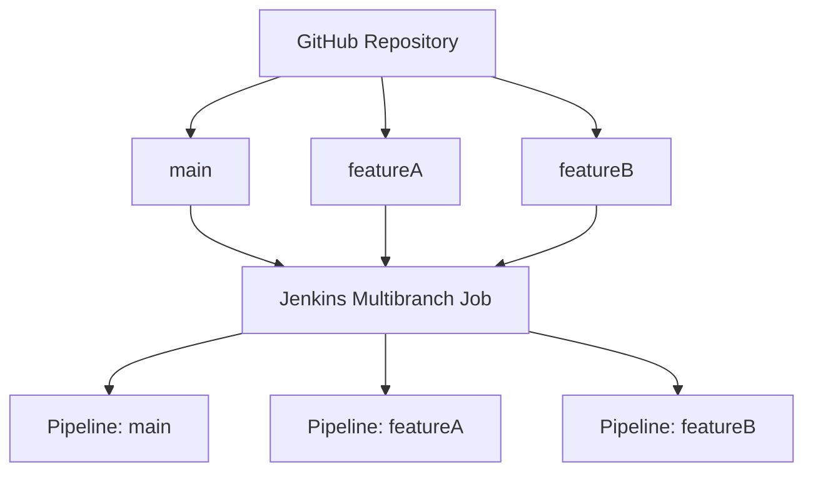

Jenkins can therefore create a separate pipeline execution context for each detected branch.

---

# 🔟 Step 10 — Understand the Jenkins Pipeline

The current Jenkinsfile contains three important ideas:

1. checkout source
2. build/push image on `main`
3. update Kubernetes manifest on `main`

---

## Stage 1 — Checkout

```groovy
stage('Checkout') {
    steps {
        checkout scm
    }
}
```

### Meaning

Jenkins checks out the branch that triggered the build.

`scm` is automatically provided by the Multibranch Pipeline job.

---

## Stage 2 — Generate a unique image tag

```groovy
env.IMAGE_TAG = "build-${BUILD_NUMBER}"
```

If Jenkins is running build 62:

```text
IMAGE_TAG=build-62
```

Final image:

```text
<registry-user>/multibranch-flask-app:build-62
```

### Why avoid only `latest`?

A unique tag gives traceability.

You can answer:

> Which exact build is running in Kubernetes?

by checking the image tag.

---

## Stage 3 — Docker build

Equivalent command:

```bash
docker build \
  -t <IMAGE_NAME>:build-<BUILD_NUMBER> \
  .
```

### Meaning

Creates an immutable application image from the repository Dockerfile.

---

## Stage 4 — Authenticate to registry

```bash
echo "$DOCKER_PASS" \
  | docker login \
      -u "$DOCKER_USER" \
      --password-stdin
```

### Why `--password-stdin`?

It avoids placing the registry password directly in the command arguments.

---

## Stage 5 — Push image

```bash
docker push <IMAGE_NAME>:<IMAGE_TAG>
```

The registry now contains the new build that Kubernetes can pull.

---

## Stage 6 — Update Kubernetes manifest

Conceptually:

```bash
sed -i \
  "s|image:.*|image: <IMAGE_NAME>:<IMAGE_TAG>|" \
  k8s/deployment.yaml
```

Example before:

```yaml
image: youruser/multibranch-flask-app:build-61
```

After Jenkins build 62:

```yaml
image: youruser/multibranch-flask-app:build-62
```

---

## Stage 7 — Commit desired-state change

```bash
git add k8s/deployment.yaml
git commit -m "chore(deploy): update image to build-62"
git push
```

This Git commit is the handoff between:

```text
Continuous Integration
        ↓
      Git
        ↓
GitOps Continuous Delivery
```

---

## Why deployment stages run only on main

The existing Jenkinsfile uses:

```groovy
when { branch 'main' }
```

That prevents a normal feature branch from automatically pushing a deployment image or changing the production manifest.

The design becomes:

```text
featureA → CI branch validation
featureB → CI branch validation
main     → build + push + deployment-state update
```

---

# 1️⃣1️⃣ Step 11 — Install and Configure Argo CD

Add the Helm repository:

```bash
helm repo add argo https://argoproj.github.io/argo-helm
helm repo update
```

Install Argo CD:

```bash
helm install argocd \
  argo/argo-cd \
  --namespace argocd \
  --create-namespace
```

Check:

```bash
kubectl get pods -n argocd
```

Wait until the main Argo CD components are running.

---

## Lab access using LoadBalancer

Change the Argo CD server Service:

```bash
kubectl patch svc argocd-server \
  -n argocd \
  -p '{"spec":{"type":"LoadBalancer"}}'
```

Check:

```bash
kubectl get svc argocd-server -n argocd
```

Get the initial admin password:

```bash
kubectl get secret argocd-initial-admin-secret \
  -n argocd \
  -o jsonpath="{.data.password}" \
  | base64 -d
echo
```

Login username:

```text
admin
```

### Security note

Exposing Argo CD directly through a public LoadBalancer is suitable only for a controlled lab/demo if properly restricted.

A production environment should use stronger network restrictions, ingress/TLS, SSO/RBAC and secure secret handling.

---

# 1️⃣2️⃣ Step 12 — Connect Argo CD to the Git Repository

The project contains an Argo CD `Application` resource.

Conceptually:

```yaml
apiVersion: argoproj.io/v1alpha1
kind: Application
metadata:
  name: shopeasy-app
  namespace: argocd
spec:
  project: default

  source:
    repoURL: https://github.com/<YOUR_GITHUB_USERNAME>/<YOUR_GITOPS_REPOSITORY>.git
    targetRevision: main
    path: k8s

  destination:
    server: https://kubernetes.default.svc
    namespace: default

  syncPolicy:
    automated:
      prune: true
      selfHeal: true
```

Before applying it, replace:

```text
<YOUR_GITHUB_USERNAME>
<YOUR_GITOPS_REPOSITORY>
```

Apply:

```bash
kubectl apply -f argocd/application.yaml
```

Check:

```bash
kubectl get applications -n argocd
```

Detailed inspection:

```bash
kubectl describe application shopeasy-app -n argocd
```

### Healthy GitOps flow

```text
Git commit
   ↓
Argo CD sees revision change
   ↓
Application becomes OutOfSync
   ↓
Automated sync starts
   ↓
Deployment image changes
   ↓
Kubernetes creates new ReplicaSet
   ↓
New pods become Ready
   ↓
Old pods terminate
   ↓
Application returns to Synced + Healthy
```

---

# 1️⃣3️⃣ Step 13 — Install Prometheus and Grafana

Add chart repository:

```bash
helm repo add prometheus-community \
  https://prometheus-community.github.io/helm-charts
```

Update:

```bash
helm repo update
```

Install the monitoring stack:

```bash
helm install monitoring \
  prometheus-community/kube-prometheus-stack \
  --namespace monitoring \
  --create-namespace
```

Check:

```bash
kubectl get pods -n monitoring
```

You should see components related to:

```text
Prometheus
Grafana
Alertmanager
kube-state-metrics
node-exporter
```

---

## Access Grafana in a lab environment

Patch Grafana Service:

```bash
kubectl patch svc monitoring-grafana \
  -n monitoring \
  -p '{"spec":{"type":"LoadBalancer"}}'
```

Get endpoint:

```bash
kubectl get svc monitoring-grafana -n monitoring
```

Get password:

```bash
kubectl get secret monitoring-grafana \
  -n monitoring \
  -o jsonpath="{.data.admin-password}" \
  | base64 -d
echo
```

Username:

```text
admin
```

Useful dashboards to explore:

```text
Kubernetes / Cluster
Kubernetes / Nodes
Kubernetes / Pods
Kubernetes / Deployments
Node Exporter
```

### What to observe

Check:

- node CPU
- node memory
- pod count
- pod restarts
- Deployment desired replicas
- Deployment available replicas
- network traffic
- container resource consumption

---

# 🌿 Branching Workflow

A clean development strategy:

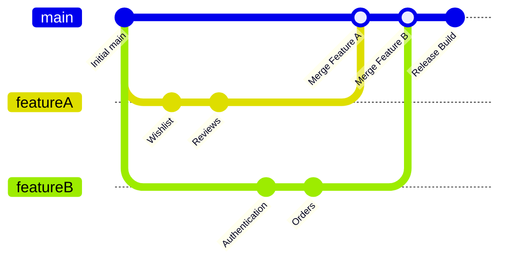

Create a branch:

```bash
git checkout -b featureA
```

Make changes.

Check:

```bash
git status
```

Stage:

```bash
git add .
```

Commit:

```bash
git commit -m "feat: add wishlist and review functionality"
```

Push:

```bash
git push -u origin featureA
```

Then create a Pull Request:

```text
featureA → main
```

After code review and merge, Jenkins detects the main-branch update and executes the delivery stages.

---

# ⚠️ Important Configuration Corrections

The uploaded repository contains several mismatches that should be corrected before you publish it as your own working DevOps project.

## 1. Manifest extension mismatch

Actual file:

```text
k8s/deployment.yaml
```

Current Jenkinsfile references:

```text
k8s/deployment.yml
```

### Correct it to

```text
k8s/deployment.yaml
```

Otherwise the `sed` and `git add` commands will fail.

---

## 2. Cluster name mismatch in the original notes

Cluster creation used:

```text
kastro-cluster
```

but kubeconfig configuration used:

```text
eks-cluster
```

Use one value consistently.

Recommended:

```bash
export CLUSTER_NAME="shopeasy-eks"

aws eks update-kubeconfig \
  --region us-east-1 \
  --name "$CLUSTER_NAME"
```

---

## 3. Jenkins Git repository and Argo CD repository are not aligned

The current Jenkinsfile pushes to:

```text
Multi-Branch-Prod.git
```

The Argo CD application watches:

```text
k8s-multi-app.git
```

This can be correct **only if Jenkins intentionally updates the separate GitOps repository**.

But the current Jenkins command edits a local `k8s/deployment` file and pushes a different repository URL, so the architecture is ambiguous.

You should choose one of the two repository strategies described below.

---

## 4. Application naming mismatch

The Flask workload is ShopEasy/e-commerce oriented, but Kubernetes resources are currently named:

```text
movie-app
movie-app-service
```

For a polished portfolio project, rename them consistently:

```text
shopeasy-app
shopeasy-service
```

And update the labels:

```yaml
app: shopeasy-app
```

in both Deployment and Service.

---

## 5. Original author-specific values remain

The uploaded files currently contain author-specific values such as:

```text
kastrov/...
KastroVKiran/...
kastrokiran
```

Before publishing to your GitHub, replace them with your own:

```text
Docker registry namespace
GitHub username
GitHub repository
Git user.name
Git user.email
Argo CD repoURL
```

Do not publish another person's access tokens or credentials.

---

## 6. Archive folder structure vs Git branch structure

The ZIP contains:

```text
Main Branch Code/
FeatureA Branch Code/
FeatureB Branch Code/
```

A real Multibranch Pipeline should preferably use actual Git branches rather than folders representing branches.

Use:

```text
main
featureA
featureB
```

inside Git.

---

# 🗂️ Recommended Repository Strategy

There are two valid ways to organize GitOps.

---

## Option A — Single Repository

Best for a compact portfolio/lab project.

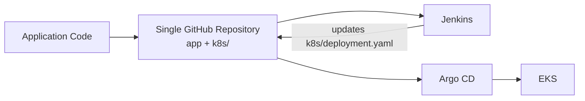

Structure:

```text
repo/
├── app.py
├── Dockerfile
├── Jenkinsfile
├── k8s/
└── argocd/
```

Argo CD watches the same repository.

### Advantage

Simpler to understand and demonstrate.

---

## Option B — Separate Application and GitOps Repositories

More separation and closer to many real GitOps environments.

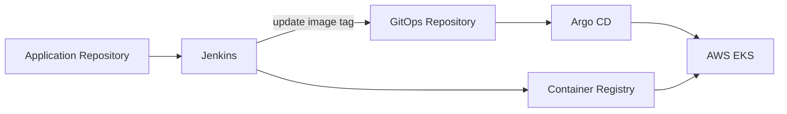

Example:

```text
Repository 1:
shopeasy-app
├── app.py
├── Dockerfile
└── Jenkinsfile

Repository 2:
shopeasy-gitops
└── k8s/
    ├── deployment.yaml
    └── service.yaml
```

Argo CD watches only `shopeasy-gitops`.

### Advantage

Clear separation between:

```text
Application Source
and
Deployment Desired State
```

If you choose this model, Jenkins must clone/update/push the **GitOps repository**, not accidentally push the application repository.

---

# 🧪 Validation Checklist

Use this section before calling the deployment complete.

## Local application

```bash
python app.py
curl http://localhost:5000
```

Expected:

- Flask starts without error
- HTTP request returns application content

---

## Docker

```bash
docker build -t shopeasy-app:test .
docker run -d --name shopeasy-test -p 5000:5000 shopeasy-app:test
docker ps
curl http://localhost:5000
```

Expected:

- image builds
- container stays running
- application responds

---

## Jenkins

Check:

```text
Feature branches discovered
Main branch discovered
Checkout succeeds
Docker build succeeds
Docker login succeeds
Docker push succeeds
Manifest update succeeds
Git commit/push succeeds
```

---

## Registry

Confirm the new tag exists:

```text
build-<JENKINS_BUILD_NUMBER>
```

---

## EKS

```bash
kubectl get nodes
kubectl get deployment
kubectl get pods
kubectl get svc
```

Expected:

```text
Nodes = Ready
Deployment = Available
Pods = Running
Service = External endpoint assigned
```

---

## Argo CD

```bash
kubectl get applications -n argocd
```

Expected application state:

```text
SYNC STATUS: Synced
HEALTH STATUS: Healthy
```

---

## Monitoring

```bash
kubectl get pods -n monitoring
```

Expected:

Monitoring components should be Running/Ready.

---

# 🛠️ Troubleshooting

## Jenkins: `docker: permission denied`

Check Jenkins group membership:

```bash
id jenkins
```

Add:

```bash
sudo usermod -aG docker jenkins
sudo systemctl restart jenkins
```

Check Docker socket:

```bash
ls -l /var/run/docker.sock
```

---

## Jenkins: `k8s/deployment.yml: No such file`

Cause:

```text
File extension mismatch
```

Fix Jenkinsfile:

```text
deployment.yml
```

to:

```text
deployment.yaml
```

---

## Docker build fails to find files

Check the Jenkins workspace:

```bash
pwd
ls -la
```

The Dockerfile expects:

```text
Dockerfile
requirements.txt
app.py
```

in the Docker build context.

If your GitHub repository still uses:

```text
Main Branch Code/
```

then Jenkins must `dir(...)` into that folder or you should reorganize the repository so these files are at the branch root.

---

## Argo CD shows `ComparisonError`

Check:

```bash
kubectl describe application <app-name> -n argocd
```

Common causes:

- wrong `repoURL`
- wrong `targetRevision`
- wrong `path`
- repository authentication failure
- invalid YAML

---

## Argo CD remains OutOfSync

Check current Application:

```bash
kubectl get application -n argocd
```

Inspect:

```bash
kubectl describe application <app-name> -n argocd
```

Check manifests locally:

```bash
kubectl apply --dry-run=client -f k8s/
```

---

## Kubernetes pods show `ImagePullBackOff`

Inspect:

```bash
kubectl describe pod <pod-name>
```

Check the image field:

```bash
kubectl get deployment <deployment-name> \
  -o jsonpath='{.spec.template.spec.containers[0].image}'
echo
```

Possible causes:

- wrong image name
- tag does not exist
- registry is private
- missing image pull secret

---

## Pod is `CrashLoopBackOff`

Logs:

```bash
kubectl logs <pod-name>
```

Previous container logs:

```bash
kubectl logs <pod-name> --previous
```

Describe:

```bash
kubectl describe pod <pod-name>
```

---

## LoadBalancer stays Pending

Check:

```bash
kubectl describe svc <service-name>
```

Also verify:

```bash
kubectl get nodes
kubectl get events --sort-by=.lastTimestamp
```

Cloud networking, IAM, subnet tags, service configuration, or quotas can affect LoadBalancer provisioning.

---

## Jenkins Git push fails

Verify credentials:

```text
Credentials ID = github-creds
```

Check token permissions and repository URL.

Also confirm that the Jenkins Git identity is configured:

```bash
git config user.name
git config user.email
```

---

## `kubectl` cannot connect to EKS

Refresh kubeconfig:

```bash
aws eks update-kubeconfig \
  --region "$AWS_REGION" \
  --name "$CLUSTER_NAME"
```

Verify AWS identity:

```bash
aws sts get-caller-identity
```

Check context:

```bash
kubectl config current-context
kubectl config get-contexts
```

---

# 🔐 Security and Production Improvements

This project demonstrates the delivery architecture, but a hardened environment should go further.

## Recommended improvements

### 1. Do not hard-code Flask secrets

Move application secrets to:

- Kubernetes Secrets
- AWS Secrets Manager
- External Secrets Operator

---

### 2. Avoid long-lived AWS credentials

Prefer:

```text
IAM Role
Instance Profile
OIDC / Workload Identity
```

rather than permanent access keys.

---

### 3. Use stronger GitHub authentication

Prefer:

- GitHub App
- scoped fine-grained token
- SSH deploy key

instead of a broadly privileged token.

---

### 4. Add automated tests before image push

Recommended pipeline:

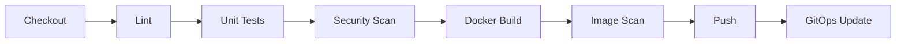

---

### 5. Add container vulnerability scanning

Possible tools:

```text
Trivy
Grype
Docker Scout
```

---

### 6. Add Kubernetes health probes

Example:

```yaml
readinessProbe:
  httpGet:
    path: /
    port: 5000

livenessProbe:
  httpGet:
    path: /
    port: 5000
```

---

### 7. Define resource requests and limits

Example:

```yaml
resources:
  requests:
    cpu: "100m"
    memory: "128Mi"
  limits:
    cpu: "500m"
    memory: "512Mi"
```

---

### 8. Add autoscaling

Use a Horizontal Pod Autoscaler when application metrics/resource utilization justify it.

---

### 9. Use Ingress + HTTPS

Production traffic would normally be routed through an ingress/load-balancing strategy with TLS rather than exposing every administrative component directly with a public LoadBalancer.

---

### 10. Add centralized logging

Possible stack:

```text
Loki + Grafana
ELK / OpenSearch
CloudWatch Container Insights
```

---

### 11. Add Infrastructure as Code

Provision cloud infrastructure using:

```text
Terraform
OpenTofu
AWS CloudFormation
```

This makes the infrastructure reproducible and reviewable.

---

# 🧹 Cleanup

Cloud resources cost money.

Delete the application:

```bash
kubectl delete -f argocd/application.yaml
kubectl delete -f k8s/service.yaml
kubectl delete -f k8s/deployment.yaml
```

Remove monitoring:

```bash
helm uninstall monitoring -n monitoring
kubectl delete namespace monitoring
```

Remove Argo CD:

```bash
helm uninstall argocd -n argocd
kubectl delete namespace argocd
```

Delete EKS cluster:

```bash
eksctl delete cluster \
  --name "$CLUSTER_NAME" \
  --region "$AWS_REGION"
```

Verify:

```bash
eksctl get cluster --region "$AWS_REGION"
```

Also review the AWS Console for remaining billable resources such as:

- Load Balancers
- EC2 instances
- EBS volumes
- Elastic IPs
- NAT Gateways
- CloudFormation stacks

---

# 🧠 Skills Demonstrated

This project demonstrates hands-on understanding of:

### CI/CD

- Jenkins
- Multibranch Pipeline
- Jenkinsfile
- build automation
- environment variables
- Jenkins credentials
- branch-based deployment conditions

### Containers

- Dockerfile
- Docker images
- container registry
- image tags
- container networking

### Kubernetes

- Deployment
- ReplicaSets
- Pods
- Services
- labels/selectors
- rolling deployment concepts
- kubectl operations

### AWS

- Amazon EKS
- EC2
- IAM concepts
- AWS CLI
- managed node groups
- cloud LoadBalancer integration

### GitOps

- desired state in Git
- Argo CD Applications
- automatic synchronization
- self-healing
- pruning
- deployment traceability

### Monitoring

- Prometheus
- Grafana
- kube-state-metrics
- Node Exporter
- Kubernetes dashboards

### Source Control

- Git
- GitHub
- feature branches
- Pull Requests
- merge workflow

---

# 🚀 Future Enhancements

- [ ] Add Pytest unit tests
- [ ] Add integration tests
- [ ] Add Jenkins test stage
- [ ] Add SonarQube analysis
- [ ] Add Trivy image scanning
- [ ] Add SBOM generation
- [ ] Add Kubernetes readiness/liveness probes
- [ ] Add resource requests and limits
- [ ] Add Horizontal Pod Autoscaler
- [ ] Add Ingress controller
- [ ] Add TLS/HTTPS
- [ ] Add AWS Route 53 domain
- [ ] Add AWS Certificate Manager
- [ ] Add Kubernetes Secrets / External Secrets
- [ ] Add Loki or OpenSearch logging
- [ ] Add Alertmanager notification routes
- [ ] Add Slack/email deployment notifications
- [ ] Provision EKS using Terraform
- [ ] Add separate development/staging/production environments
- [ ] Add Argo CD Projects and stronger RBAC
- [ ] Add policy-as-code
- [ ] Add automated rollback/deployment verification
- [ ] Add blue/green or canary deployment strategy

---

# 🎓 Key Learning Outcome

The biggest learning point from this project is that **DevOps is not a collection of isolated tools**.

Each tool solves a different part of the software delivery problem:

```text
GitHub
  │
  │ stores source code
  ▼
Jenkins
  │
  │ automates build and release preparation
  ▼
Docker
  │
  │ packages the application
  ▼
Container Registry
  │
  │ stores immutable versions
  ▼
Git
  │
  │ stores deployment desired state
  ▼
Argo CD
  │
  │ reconciles Git with Kubernetes
  ▼
AWS EKS
  │
  │ runs the workload
  ▼
Prometheus
  │
  │ collects operational metrics
  ▼
Grafana
  │
  │ turns metrics into visibility
  ▼
DevOps Engineer
```

Together, these tools create a traceable delivery path from:

```text
Source Code
        ↓
Automated Build
        ↓
Immutable Container
        ↓
Versioned Deployment Configuration
        ↓
GitOps Synchronization
        ↓
Cloud Runtime
        ↓
Monitoring and Observability
```

---

# 👨‍💻 Author

## Rahmanuddin MD

**Engineering Automation | AI/ML | Cloud & DevOps**

- GitHub: `https://github.com/rahmanuddinmd`
- LinkedIn: `https://www.linkedin.com/in/md-rahmanuddin/`

---

# ⭐ Project Support

If this repository helps you understand CI/CD and GitOps:

- ⭐ Star the repository
- 🍴 Fork it
- 🌿 Create a feature branch
- 🧪 Extend the pipeline
- ☸️ Experiment with Kubernetes
- 🔄 Improve the GitOps workflow
- 📊 Add your own Grafana dashboards

---

<div align="center">

## Build → Automate → Containerize → Deploy → Observe → Improve

### DevOps is the engineering of the complete delivery system.

</div>
